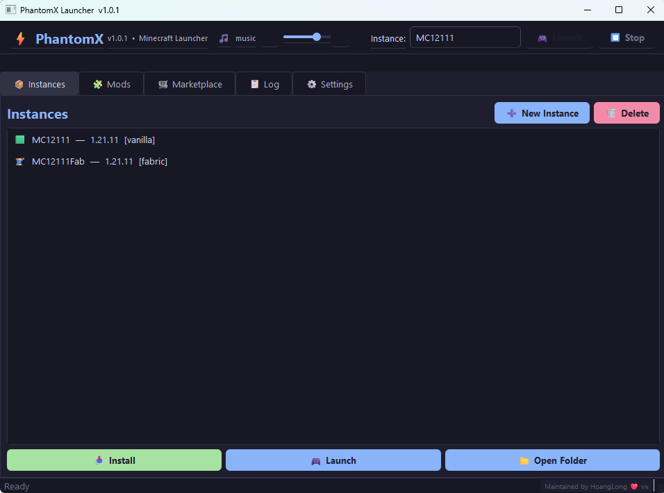
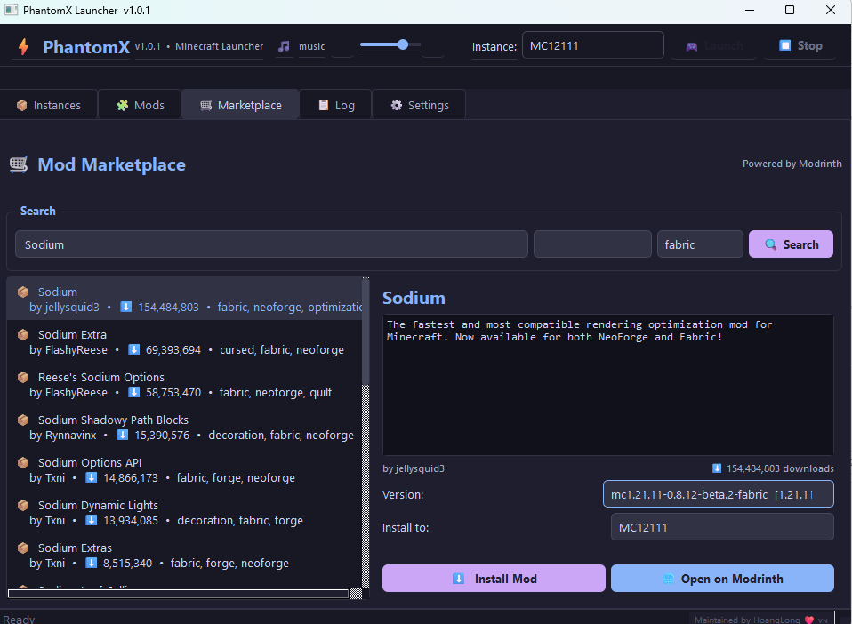

# PhantomX Minecraft Launcher

Modern Minecraft launcher built for speed, simplicity, and modded gameplay.

PhantomX is a lightweight and open-source Minecraft launcher powered by **PyQt6** and **minecraft-launcher-lib**, designed to provide a clean native desktop experience with built-in mod management, multiple isolated instances, and direct integration with the Modrinth ecosystem.

> **This launcher only supports Offline (Cracked) play.**
> You cannot join major, long-standing, or premium-verified servers. However, LAN play and joining other cracked servers are fully supported.

---

## ✨ Features

### 📦 Instance Management
Create and manage unlimited Minecraft instances independently.

- Separate directories for each instance
- Custom settings per profile
- No file conflicts between modpacks
- Easy install and removal

---

### 🧩 Loader Support
Supports the most popular Minecraft mod loaders:

- Vanilla
- Fabric
- Forge
- Quilt

Automatic loader installation and smart version detection help reduce unnecessary downloads and setup time.

---

### 🛒 Built-in Mod Marketplace
Integrated directly with the Modrinth API.

Search, browse, and install mods without opening your browser.

Features include:

- Real-time search
- Version filtering
- Loader filtering
- One-click installation
- Mod details viewer

---

### ⚡ Optimized JVM Flags
Includes pre-configured Aikar JVM flags for better performance.

Benefits:

- Reduced garbage collection pauses
- Improved FPS stability
- Better performance for large modpacks

---

### 🎵 Theme Music Player
Built-in music player with persistent settings.

- Plays music from `./theme/music.mp3`
- Volume control support
- Toggle on/off anytime
- Settings saved automatically

---

### 🔒 Keyring & Auto-save
Secure and convenient account handling.

- Username stored using OS keyring
- Automatic configuration saving
- Persistent launcher settings

---

## 🖥️ Screenshots

---

## 📋 Requirements
- Python: 3.11+
- Java: 17 or 21 Recommend [Amazon Corretto](https://corretto.aws/downloads/latest/amazon-corretto-21-x64-windows-jdk.msi)
- OS: Windows, Mac, Linux

---

## 🚀 Installation
### 1. Download the launcher

**Download** the **latest release** from **GitHub Releases**:
https://github.com/hoanglonggg79/PhantomXLauncher/releases

### 2. Extract the files

**Extract** the archive and **read**:
- README.TXT
- PhatomX_Info HTML documentation

### 3. Launch PhantomX

RUN :
**PhantomXLauncher.exe**

Then install your Minecraft version, mods, and start playing.
(From the moment you start installing, the process may take 2-5 minutes depending on your network bandwidth.)

---
## 🛠️ Built With
- PyQt6
- minecraft-launcher-lib
- Modrinth API
- loguru

---

## 📄 License

Licensed under the GNU GPL v3 License.
This project is open source and free to modify under GPL terms.

---

## ❤️ Credits

Maintained by HoangLong

Built for the Minecraft community with a focus on performance, usability, and clean design. Thank you for using PhantomX!
