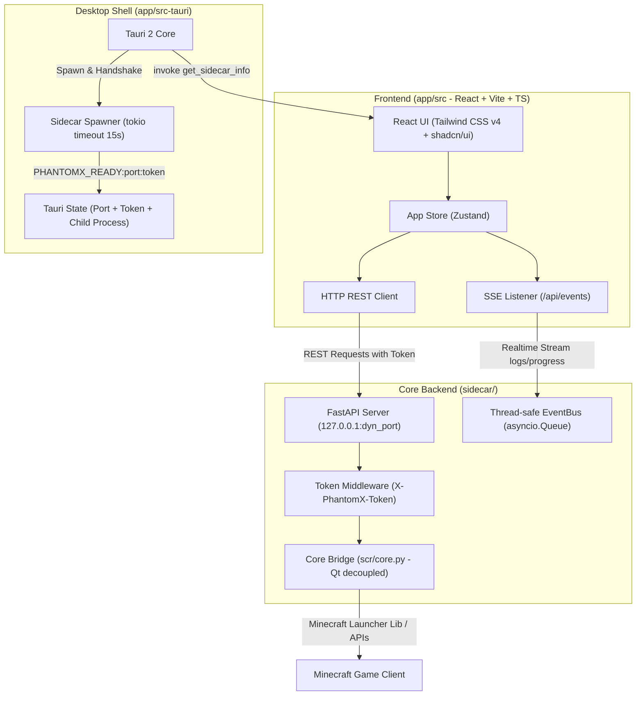

# PhantomX Minecraft Launcher (v1.2.0)

<div align="center">


### **The Next-Generation Minecraft Launcher**
*Engineered for extreme performance, Cyberpunk aesthetics, effortless modding, and seamless gameplay.*

[](https://github.com/hoanglonggg79/PhantomXLauncher/releases)
[](https://tauri.app/)
[](https://react.dev/)
[](https://fastapi.tiangolo.com/)
[](./LICENSE)
[](https://discord.gg/PECavu2q4w)

</div>

---

> [!NOTE]
> **Account Support:** PhantomX fully supports **Offline (Cracked)** play and custom skin authentication via **Ely.by** (with automatic `authlib-injector` injection). LAN play and community servers are 100% supported.

---

## Highlights of Version 1.2.0

PhantomX 1.2.0 is a complete overhaul and ground-up architectural rewrite, transitioning from legacy PyQt to a modern **3-Tier Desktop Architecture**:


```mermaid
graph TD
    subgraph UI ["Frontend (app/src - React + Vite + TS)"]
        ReactApp["React UI (Tailwind CSS v4 + shadcn/ui)"]
        ZustandStore["App Store (Zustand)"]
        SSEClient["SSE Listener (/api/events)"]
        HTTPClient["HTTP REST Client"]
    end

    subgraph RustBackend ["Desktop Shell (app/src-tauri)"]
        TauriApp["Tauri 2 Core"]
        Spawner["Sidecar Spawner (tokio timeout 15s)"]
        StateStore["Tauri State (Port + Token + Child Process)"]
    end

    subgraph PythonSidecar ["Core Backend (sidecar/)"]
        FastAPIApp["FastAPI Server (127.0.0.1:dyn_port)"]
        TokenAuth["Token Middleware (X-PhantomX-Token)"]
        EventBus["Thread-safe EventBus (asyncio.Queue)"]
        CoreBridge["Core Bridge (scr/core.py - Qt decoupled)"]
    end

    ReactApp --> ZustandStore
    ZustandStore --> HTTPClient
    ZustandStore --> SSEClient
    HTTPClient -->|REST Requests with Token| FastAPIApp
    SSEClient -->|Realtime Stream logs/progress| EventBus
    TauriApp -->|Spawn & Handshake| Spawner
    Spawner -->|PHANTOMX_READY:port:token| StateStore
    TauriApp -->|invoke get_sidecar_info| ReactApp
    FastAPIApp --> TokenAuth
    TokenAuth --> CoreBridge
    CoreBridge -->|Minecraft Launcher Lib / APIs| GameProcess["Minecraft Game Client"]

```

---

## Features

### Isolated Instance Management
- **Total Independence:** Each Minecraft profile lives in its own dedicated directory. Modpacks, configs, resource packs, and worlds never conflict.
- **Dynamic Loader Support:** One-click automated setup for **Vanilla**, **Fabric**, **Forge**, **Quilt**, and **NeoForge**.
- **Instance Actions:** Clone / Duplicate, rename, edit notes, explore local folder via Windows Explorer, and atomic deletion.
- **Preconfigured JVM Optimization:** Integrated with community-proven Aikar JVM flags for ultra-smooth garbage collection and maximum FPS.

### Unified Mod Marketplace
- **Direct Search & Download:** Browse and install thousands of mods directly inside the launcher from **Modrinth v2** and **CurseForge** (via secure Cloudflare Worker proxy).
- **Interactive Lightbox:** Preview screenshot galleries and read formatted project descriptions without leaving the app.
- **Smart Compatibility:** Automatic filtering by game version, loader, and release channel (Release / Beta / Alpha).
- **Instance Running Guard:** Protects against overwriting or modifying files while the instance is actively running.

### 1-Click Modpack Installer
- **Universal Drag & Drop:** Drop `.mrpack` (Modrinth) or `.zip` (CurseForge) directly into the UI.
- **Intelligent Extraction:** Automated manifest parsing, staging directory verification, parallel asset downloads, and atomic instance registration.

### Advanced Diagnostics & System Repair
- **SHA-1 Integrity Verification:** High-speed multi-threaded (`ThreadPoolExecutor`) hash checker comparing version manifests, client JARs, libraries, and asset indexes. Re-downloads only corrupted files without wiping user data.
- **Regex 80/20 Crash Log Analyzer:** Instantly diagnoses the root cause of crashes:
  - **Out of Memory (OOM)** $\rightarrow$ Quick action to increase RAM allocation.
  - **Mod Dependency Conflicts** $\rightarrow$ Identifies missing or incompatible mods with quick navigation to Mod Manager.
  - **Java Version Mismatches** $\rightarrow$ Direct link to switch between Java 8, 17, and 21.
- **Quick Actions:** One-click **"Copy Log"** button, `options.txt` reset, and global cache cleanup.

### Identity & Skin System
- **Offline Mode:** Simple username-based gameplay with instant UUID generation.
- **Ely.by Integration:** Full OAuth2 login with automatic `authlib-injector` JVM agent injection. Display high-res skins, capes, and player avatars in real time.
- **Hardened Security:** Credentials stored securely via Windows Credential Manager / OS Keyring with Portable Fernet fallback encryption.

### Java Runtime Manager
- **System Discovery:** Auto-scans `PATH`, `JAVA_HOME`, Windows Registry, and well-known installation paths.
- **1-Click Adoptium JRE Downloader:** Automatically download and extract official OpenJDK JRE 8 (Legacy), JRE 17 (Gamma), or JRE 21 (Delta).

### Ambient Music & Discord Rich Presence
- **Background Music Player:** Built-in relaxing soundtrack with audio wave animations, volume slider, mute toggle, and seamless Webview autoplay unlocking.
- **Dynamic Discord RPC:** Shows rich live presence on your Discord profile:
  - *Browsing Launcher (Idle)*
  - *Dạo quanh Marketplace (Searching Mods)*
  - *Playing Minecraft* with instance name, loader badge, elapsed playtime, and supporter flair.

---

## 🖥️ System Requirements

| Component | Minimum | Recommended |
| :--- | :--- | :--- |
| **Operating System** | Windows 10 (64-bit) | Windows 10 / 11 (64-bit) |
| **Processor** | Intel Core i3 / AMD Ryzen 3 | Intel Core i5 / AMD Ryzen 5 or better |
| **Memory (RAM)** | 4 GB RAM | 8 GB – 16 GB RAM |
| **Graphics** | OpenGL 4.4 compatible GPU | Dedicated NVIDIA / AMD / Intel Arc GPU |
| **Java** | Built-in 1-Click Installer | JDK 8, 17, 21 or 25 |

---

## Installation & Quick Start

### For Players:
1. **Download** the latest release package from [GitHub Releases](https://github.com/hoanglonggg79/PhantomXLauncher/releases).
2. **Extract** the `.zip` archive to any directory (fully portable, USB drives supported via `portable.txt`).
3. **Launch** `PhantomX.exe` and enjoy!

### For Developers:

#### 1. Clone Repository
```bash
git clone https://github.com/hoanglonggg79/PhantomXLauncher.git
cd PhantomXLauncher
```

#### 2. Setup Python Sidecar
```bash
python -m venv .venv
.venv\Scripts\activate
pip install -r requirements.txt
```

#### 3. Setup & Build Frontend
```bash
cd app
npm install
npm run dev
```

#### 4. Run with Tauri Desktop Shell
```bash
# In the app/ directory
npm run tauri dev
```

---

## Technology Stack

- **Desktop Framework:** [Tauri 2](https://tauri.app/) (Rust)
- **Frontend:** [React 19](https://react.dev/), [TypeScript](https://www.typescriptlang.org/), [Vite](https://vite.dev/)
- **Styling & Components:** [Tailwind CSS](https://tailwindcss.com/), [shadcn/ui](https://ui.shadcn.com/), [Lucide Icons](https://lucide.dev/)
- **State Management:** [Zustand](https://github.com/pmndrs/zustand)
- **Core Backend:** [Python 3.11+](https://www.python.org/), [FastAPI](https://fastapi.tiangolo.com/), [Uvicorn](https://www.uvicorn.org/)
- **Minecraft Core:** [minecraft-launcher-lib](https://gitlab.com/JakobDev/minecraft-launcher-lib)
- **Packaging:** [Nuitka](https://nuitka.net/)

---

## License

Distributed under the **GNU General Public License v3.0 (GPLv3)**. See [`LICENSE`](./LICENSE) for more information.

---

<div align="center">

Made with ❤ for the Vietnam Minecraft community.  
**PhantomX Team** • [Join our Discord](https://discord.gg/PECavu2q4w) • [Report a Bug](https://github.com/hoanglonggg79/PhantomXLauncher/issues)

</div>
