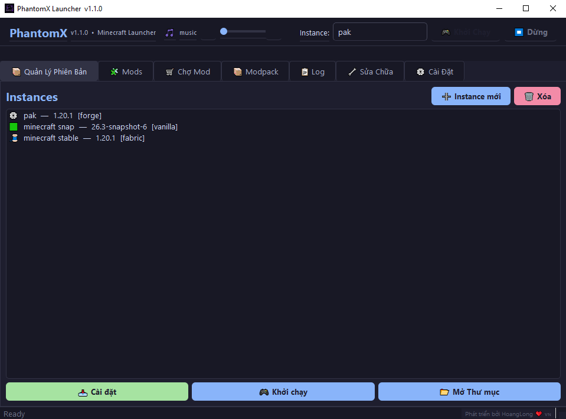
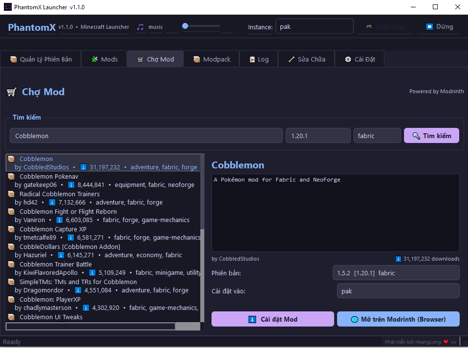
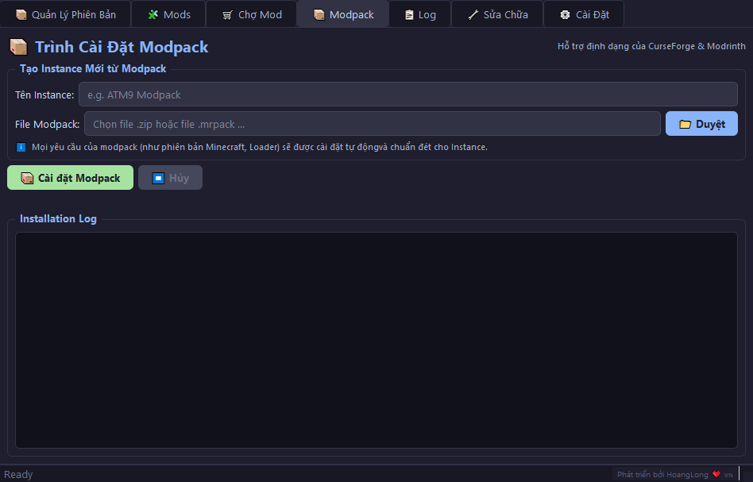

# PhantomX Minecraft Launcher

Modern Minecraft launcher built for speed, simplicity, and modded gameplay.

PhantomX is a lightweight and open-source Minecraft launcher powered by **PyQt6** and **minecraft-launcher-lib**, designed to provide a clean native desktop experience with built-in mod management, multiple isolated instances, and direct integration with the Modrinth ecosystem.

> **This launcher only supports Offline (Cracked) play.**
> You cannot join major, long-standing, or premium-verified servers. However, LAN play and joining other cracked servers are fully supported.

---

## ✨ Features

### Instance Management
Create and manage unlimited Minecraft instances independently.

- Separate directories for each instance
- Custom settings per profile
- No file conflicts between modpacks
- Easy install and removal
- **Play count & last-played tracking** per instance
- **Notes field** for per-instance annotations

---

### Loader Support
Supports the most popular Minecraft mod loaders:

- Vanilla
- Fabric
- Forge
- Quilt
- NeoForge

Automatic loader installation and smart version detection help reduce unnecessary downloads and setup time.

---

### Built-in Mod Marketplace
Integrated directly with the Modrinth API.

Search, browse, and install mods without opening your browser.

Features include:

- Real-time search
- Version filtering by Minecraft version and loader
- One-click installation into selected instance
- Mod details viewer with download count
- **"Open on Modrinth" browser button** *(NEW in v1.1.0)*
- Download progress bar for mod installs *(NEW in v1.1.0)*

---

### Modpack Installer
Install modpacks from **CurseForge** (`.zip`) and **Modrinth** (`.mrpack` / `.zip`) files directly into the launcher.

- Automatic format detection
- Auto-detects Minecraft version and loader from manifest
- Concurrent async mod downloads with progress tracking
- Applies `overrides/` and `client-overrides/` folders automatically
- Creates and registers a launcher instance automatically after installation
- Duplicate instance name detection with overwrite option

---

### Instance Repair
Two-phase repair tool that fixes corrupted or missing game files **without touching user data** (mods, saves, configs, resource packs, and shader packs are safe).

- **Phase 1 — Scan:** Checks version JAR, libraries, and assets; verifies SHA-1 hashes
- **Phase 2 — Download:** Re-downloads missing/corrupted files concurrently
- **Phase 3 — Rebuild:** Re-extracts native libraries from JARs
- **Deep Repair** option for full SHA-1 verification of all assets
- Stop button to cancel ongoing repair
- Detailed summary report after completion

---

### Optimized JVM Flags
Includes pre-configured Aikar JVM flags for better performance.

Benefits:

- Reduced garbage collection pauses
- Improved FPS stability
- Better performance for large modpacks

---

### ☕ Java Runtime Installer
Install official Microsoft OpenJDK runtimes directly from the Settings tab via Windows Winget.

- **Java 8**, **Java 17**, and **Java 21** support
- Fully automated & silent background installation
- Automatically configures System PATH and Registry to prevent mod loader errors

---

### Theme Music Player
Built-in music player with persistent settings.

- Plays music from `./theme/music.mp3`
- Volume control with slider
- Mute toggle
- Auto-loop support
- Settings saved automatically

---

### Auto-Update Checker
Checks for new versions on startup in a background thread.

- Prompts with a dialog if a newer release is available
- Opens the GitHub Releases page for download

---

### Discord Rich Presence
Shows your current activity in Discord:

- "Đang chơi: {instance}" when a game is running
- "Ở giao diện chính" when idle

---

### Pre-Launch Cleanup
Automatically cleans up before launching:

- Removes `.tmp` and `.lock` files
- Cleans up old crash reports (keeps the 10 most recent)

---

### Mod Management
Enhanced mod management in the Mods tab:

- **Toggle mods** on/off by renaming `.jar` ↔ `.disabled` (disable without deleting)
- **Delete mods** directly from the mods folder
- **Mod conflict detection** — warns when duplicate filenames exist
- File size and SHA-1 hash display per mod

---

### Keyring & Auto-save
Secure and convenient account handling.

- Username stored using OS keyring
- Automatic configuration saving on exit
- Persistent launcher settings

---

### Settings Tab
New comprehensive Settings tab with organized groups:

- **Offline Account** — username input
- **Java** — custom path, auto-detect, runtime installer
- **Memory** — RAM allocation with **auto-detection** using `psutil`
- **Microsoft Account** — preserved for future use (coming soon)
- **JVM Arguments** — custom extra JVM flags
- **Data Directory** — quick access to launcher data folder
- **Links & Resources** — YouTube channel & GitHub links
- **Misc** — snapshot toggle, close-on-launch option

---

###  Dark Theme UI
Catppuccin Mocha-inspired dark theme applied globally.

- Color-coded log levels (INFO/SUCCESS/WARN/ERROR/GAME)
- Watermark label in status bar
- Quick-launch combo box for fast instance launching

---

## 🖥️ Screenshots





---

##  Requirements
- Python: 3.11+
- Java: 17 or 21
- OS: Windows, Mac, Linux

---

##  Installation
### 1. Download the launcher

**Download** the **latest release** from [**GitHub Releases**](
https://github.com/hoanglonggg79/PhantomXLauncher/releases)

### 2. Extract the files

**Extract** the archive

### 3. Launch PhantomX

RUN :
**PhantomXLauncher.exe**

### For Devs:
```cmd
### Clone repository
git clone https://github.com/hoanglonggg79/PhantomXLauncher.git
cd PhantomXLauncher

### Install dependencies
pip install -r requirements.txt

### Run
python PhantomXLauncher.py
```

Then install your Minecraft version, mods, and start playing.\
(From the moment you start installing, the process may take 2-5 minutes depending on your network bandwidth.)

---
## 🛠️ Built With
- PyQt6
- minecraft-launcher-lib
- Modrinth API
- loguru

---

## 📄 License

Licensed under the GNU GPL v3 License.\
This project is open source and free to modify under GPL terms.

---

## Credits
Maintained by HoangLong\
An open-source Minecraft launcher for the Vietnamese community.\
\
Thank you for using PhantomX!
