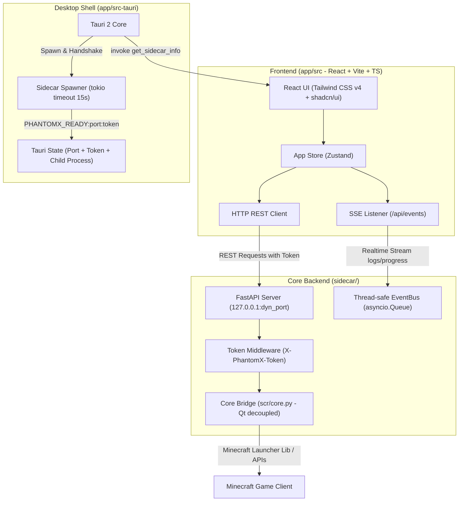

# PhantomX Launcher: Handover Document & UI Overhaul Roadmap

**Current Version:** 1.2.0
**Last Updated:** September 11, 2026 (v1.2.0: Ely.by Authentication Integration, Marketplace Lightbox fix, External Links permission) IMPORTANT: ABSOLUTELY KEEP VERSION 1.2.0 - DO NOT BUMP VERSION

**Project:** Comprehensive migration of PhantomX Launcher from **PyQt6 (Legacy UI `scr/`)** to **Tauri 2 (Rust) + Python FastAPI Sidecar + React/TypeScript (New UI `app/`)**.

**Audience:** Fullstack / Frontend & Backend Engineers taking over development.

---

## 🏗️ 1. Current Architectural Overview

The new interface operates on an isolated, secure, high-performance 3-tier architecture model:



---

## 📊 2. Feature Comparison Matrix: Legacy (`scr/`) vs New (`app/` + `sidecar/`)

| Feature Module | Legacy UI (`scr/` - PyQt6) | New UI (`app/` + `sidecar/`) | Migration Status | Priority Level |
| --- | --- | --- | --- | --- |
| **Basic Instance Management** | Create, download files, launch, terminate process | Grid view, Create instance (Vanilla/Fabric/Forge), Play/Stop, RAM config | 🟢 **100% Completed** | **P0 (Core)** |
| **Advanced Instance Actions** | Delete, Rename, Clone instance, Notes, Open folder | Full UI Action Menu (`...`), Clone Modal, Delete Modal, Edit/Notes Modal, Open Folder connected | 🟢 **100% Completed** | **P0 (Core)** |
| **Local Mod Management** | Enable/disable mods (`.disabled`), add/delete `.jar` files, open mods folder | ✅ **Sprint 1 Complete** — `ModManagerDialog` + 5 backend endpoints (`GET /mods`, `POST /mods/toggle`, `DELETE /mods/{filename}`, `POST /mods/open-folder`, `POST /mods/upload`) | 🟢 **100% Completed** | **P0 (Core)** |
| **Mod Marketplace** | Direct search & download from Modrinth + CurseForge | ✅ **Sprint 3A Complete** — `MarketplaceView` + `ModDetailModal` (Modrinth & CurseForge Worker Proxy), Raw/CDN icon viewing, Screenshot Gallery Lightbox, 1-Click SSE install + Instance Running Guard | 🟢 **100% Completed** | **P1 (High)** |
| **Modpack Installation** | Online installation (CurseForge/Modrinth) & zip/mrpack import | ✅ **Sprint 3B Complete** — Drag & drop / upload `.zip` & `.mrpack`, manifest auto-parsing, safe staging provisioning, parallel mod downloads, overrides extraction, atomic instance commit + SSE progress stream | 🟢 **100% Completed** | **P1 (High)** |
| **Diagnostics & Repair** | SHA-1 hash verification, Crash Log Analyzer, cache cleaning, options reset, Bug Reporter | ✅ **Sprint 4 Complete** — `RepairDialog` (3 tabs: SHA-1 ThreadPool verification, Regex 80/20 Crash Analyzer with quick action suggestions & copy log button, reset options.txt, cache cleaning) + `ReportBugDialog` | 🟢 **100% Completed** | **P1 (High)** |
| **Account Authentication** | Offline username only | ✅ **Sprint 3A+ Complete** — Offline username + Full Ely.by custom skin authentication via Authlib-Injector, Keyring/Portable Fernet secure credential storage, AccountPill in Header, AccountSection in Settings, auto session restore on startup | 🟢 **100% Completed** | **P0 (Core)** |
| **Microsoft Account (MSA)** | OAuth Device Code flow, Token Refresh, Secure Keyring | Postponed to dedicated future sprint (Offline & Ely.by ready) | 🔴 **0% (Postponed)** | **P1 (High)** |
| **Java Runtime Management** | System Java scanning + Adoptium API automated JRE 8/17/21 downloads | ✅ **Sprint 2 Complete** — Scan PATH/JAVA_HOME/Registry/well-known/PhantomX runtimes, Adoptium API automated JRE 8/17/21 downloads + strip-root, JavaManagerSection in Settings | 🟢 **100% Completed** | **P1 (High)** |
| **Discord Rich Presence (RPC)** | Realtime launcher & active playing status updates | ✅ **Sprint 4 Complete** — Non-blocking `pypresence` worker, Application ID `1526783238406672475`, auto in-game / marketplace / idle status mapping, elapsed playtime, loader icons & supporter badges | 🟢 **100% Completed** | **P2 (Experience)** |
| **Background Music Player** | Relaxing Minecraft background music, volume slider, mute, auto-loop | ✅ **Sprint 4 Complete** — `theme_audio` service, HTTP stream `/api/system/theme/audio`, `BackgroundMusicPlayer` widget in Header with animated wave, Webview autoplay unlocking, SettingsPanel volume slider & toggle | 🟢 **100% Completed** | **P2 (Experience)** |
| **Console & Log Viewer** | Global LogTab, level filtering, text search, log export | TaskConsole for per-task SSE log viewing + Heartbeat + Cancel | 🟢 **85% Completed** | **P2 (Experience)** |
| **Automated Update Checking** | Auto-checks GitHub releases upon application launch | ✅ **Sprint 3A Complete** — Startup `version.txt` check against GitHub raw, `UpdateDialog` prompt with GitHub release redirection | 🟢 **100% Completed** | **P2 (Experience)** |
| **Supporter Badge System** | None (Community Honor System) | ✅ **Sprint 3A++ Complete & Hardened** — RSA-2048 Offline Signed Token verification (re-verified on every /status read, zero bypass via config.json), theme auto-save persistence, Emerald Badge UI, AccountPill ring + 💎 dot, Cyberpunk Neon & Synthwave exclusive themes | 🟢 **100% Completed** | **P3 (Nice to have)** |


---

## 🔍 3. Technical Guidance & Missing Logic Details

---

### 📦 3.1. Advanced Instance Management

* **Legacy Source Reference:** `scr/ui_tabs.py:InstanceTab` & `scr/core.py:Instance`.
* **Current Gap:** `InstanceCard.tsx` only includes Play/Stop and Repair buttons.
* **Requirements:**
1. **Actions Dropdown Menu (`...`)** on each Instance Card:
* **Open Game Folder (`Open Folder`)**: Trigger API to open the instance directory via Windows Explorer (`os.startfile` or Tauri `shell.open`).
* **Delete Instance (`Delete`)**: Confirmation dialog asking: "Remove from list only" vs "Permanently delete all folder data".
* **Clone / Duplicate (`Clone / Duplicate`)**: Copy the entire instance directory to a new target folder (facilitates mod testing).
* **Edit Details (`Edit Info`)**: Allow updating instance title, notes (`notes`), and avatar/icon assets.


2. **Complete Dynamic Loader Version Resolution**:
* Implement API endpoints in `sidecar/api/minecraft.py` to fetch version lists for **Quilt** and **NeoForge**.


---

### 🧩 3.2. Local Mod Management (Instance Mod Manager)

* **Legacy Source Reference:** `scr/ui_tabs.py:ModTab`.
* **Objective:**
* Build a detailed view screen or dialog for managing installed mods within a selected Instance.


* **Migration Requirements:**
1. **Parse Installed Mods**: Scan the `<instance_path>/mods/` folder and enumerate all `.jar` and `.jar.disabled` files.
2. **Toggle Enable / Disable State**: Rename file extensions between `abc.jar` $\leftrightarrow$ `abc.jar.disabled`.
3. **Add Mods**: Support drag-and-drop file ingestion onto the UI or provide an "Add Mod" file picker to copy selected packages into the `mods/` directory.
4. **Delete Mods**: Remove target `.jar` files from disk.
5. **Filter & Search**: Implement real-time filtering by filename and enabled/disabled status.


---

### 🛒 3.3. Online Mod Marketplace

* **Legacy Source Reference:** `scr/ui_tabs.py:MarketplaceTab` & `scr/core.py:ModSearchWorker`.
* **Objective:**
* Dedicated **"Marketplace"** tab in the main sidebar.


* **Migration Requirements:**
1. **Modrinth & CurseForge API Integration**:
* Keyword queries.
* Multi-faceted filtering: Minecraft version (`1.20.4`, `1.21`, etc.), Mod Loader (`Fabric`, `Forge`, `NeoForge`), Categories (Optimization, Technology, Magic, Utility, etc.).
* Sorting parameters: Download count, ratings, recency.


2. **Mod Overview View**: Render icon, banner, author, brief description, and `.jar` release history.
3. **1-Click Installation (`Install into Instance`)**:
* Target instance selector interface.
* Sidecar downloads compatible mod builds and automatically resolves/fetches declared dependencies.


---

### 📦 3.4. Modpack Installation & Management

* **Legacy Source Reference:** `scr/ui_modpack.py`.
* **Objective:**
* Introduce a **"Modpack"** tab to discover online modpacks or import locally from ZIP/MRPACK files.


* **Core Installation Workflow (`ModpackInstallWorker`):**
1. **Manifest Parsing**: Unpack `.zip` files (CurseForge `manifest.json`) or `.mrpack` files (Modrinth `modrinth.index.json`).
2. **Automated Instance Provisioning**: Initialize a new instance environment mapped to required Minecraft and Loader releases (Forge/Fabric/NeoForge).
3. **Parallel Asset Downloading**: Multi-threaded downloader pulling mod files concurrently via Project ID & File ID manifests (streaming progress logs via SSE).
4. **Override Extraction**: Copy bundled runtime configurations, keybinds, scripts, and shaderpacks directly to the destination instance folder.


---

### 🔧 3.5. Game Diagnostics & Repair System

* **Legacy Source Reference:** `scr/ui_repair.py:RepairTab`.
* **Migration Requirements:**
1. **Integrity Hash Verification**:
* Compare local SHA-1 hashes across `libraries/`, `assets/`, and `client.jar` files against official Mojang manifests.
* Target and re-download only corrupted or missing assets without re-downloading healthy files.


2. **Crash Log Analyzer**:
* Parse `crash-reports/` logs or `latest.log`.
* Automatically flag common root causes:
* Out of Memory (OOM) $\rightarrow$ Recommend increasing RAM allocation in Settings.
* Mod Conflicts / Missing Dependencies (e.g., Missing Fabric API) $\rightarrow$ Highlight conflicting mod names.
* Java Runtime Mismatches (Java 8 vs 17 vs 21) $\rightarrow$ Identify required Java version.


3. **Cleanup & Reset Tools**:
* Clear legacy logs and `.tmp` disk clutter.
* Reset `options.txt` to defaults when handling display driver or resolution-related startup failures.


---

### 🔐 3.6. Microsoft Authentication (MSA) & Security

> **Important Note:** In the legacy codebase, MSA was labeled as *Coming Soon* and disabled. It remains disabled and grayed-out in the new GUI as it is not yet production-ready. The login logic exhibits various edge-case failures and is scheduled to be stabilized in future minor releases.

* **Legacy Source Reference:** `scr/core.py:MicrosoftAuthWorker` & `scr/main_window.py`.
* **Migration Requirements:**
1. **Native Microsoft OAuth**:
* Implement OAuth2 Device Code flow (present user code + `microsoft.com/link` authentication URL).


2. **Secure Token Persistence**:
* Utilize Python `keyring` to store `refresh_token` credentials inside Windows Credential Manager securely.


3. **Automated Refresh on Boot**:
* Intercept game launch actions to validate and update the active `access_token`.


4. **Profile Rendering**:
* Fetch account UUID and render 3D skin/avatar assets in the application header.


---

### ☕ 3.7. Java Runtime Provisioning & Management

* **Legacy Source Reference:** `scr/core.py:JavaRuntimeWorker`.
* **Migration Requirements:**
1. **System Java Detection**: Discover local installations under `C:\Program Files\Java`, `AppData`, and standard system paths.
2. **Automated Adoptium API Downloads (Eclipse Temurin)**:
* When required Java versions are missing (e.g., MC 1.20.5+ requires Java 21; MC 1.18+ requires Java 17; MC 1.12.2 requires Java 8):
* Sidecar automatically downloads and extracts JRE environments into `%LOCALAPPDATA%\PhantomXTeam\PhantomX\runtimes\`.


---

### 🎵 3.8. Utilities: Discord RPC & Background Music Player

1. **Discord Rich Presence (`scr/core.py:DiscordPresence`)**:
* Idle State: Show *"In Launcher - Idle"*.
* In-Game State: Show *"Playing [Instance Name] - Minecraft [Version]"* with an active playtime timer.


2. **Background Music Player (`scr/ui_tabs.py:MusicPlayerWidget`)**:
* Audio widget for playing ambient Minecraft tracks inside the Header/Sidebar UI.
* Includes Play/Pause controls, volume slider, mute toggle, auto-looping, and local configuration persistence.

---

### 🌟 3.9. Supporter Badge System (Community Honor & Local Offline Verification)

* **Documentation Reference:** 📄 See full integration specs in [`PTX_Bot/docs.md`](./PTX_Bot/docs.md) (authored by Bot Dev).
* **Objective:** Allow users to redeem a Supporter Code provided by the Discord Bot to unlock an **Emerald Avatar Border (`#10b981`)** and a **🌟 Supporter Badge** next to their username in `AccountPill` and `SettingsPanel`.
* **Technical Constraints:**
  1. **100% Offline Validation:** Verification MUST occur inside Python Sidecar using RSA-2048 Public Key (`supporter_public.pem`). Zero network calls to local/external APIs.
  2. **No Privacy Tracking:** Absolutely NO HWID collection or silent telemetry.
* **Sidecar Endpoint Specification:**
  * `POST /api/supporter/verify`: Accepts `{ "token": string }`. Decodes Base64URL token, splits payload and RSA signature at `0x00` null byte, verifies with `cryptography` Python library. Returns `{ "valid": true, "badge": "supporter", "discord_id": string }`.
* **Persistence:** On success, save status to `%LOCALAPPDATA%\PhantomXTeam\PhantomX\config.json`.

---

## 📡 4. Required Sidecar API Specifications

Backend API endpoints in `sidecar/api/` serving the React frontend.
*(All requests must include the header `X-PhantomX-Token: <token>` except public endpoints)*:

### 1. Instance Management (`/api/instances`)

* `GET /api/instances`: List all local instances (`{"instances": [...], "count": number}`).
* `POST /api/instances/create`: Create and install new instance (`{"name": string, "version_id": string, "loader": string, "loader_version": string}`). Returns 202 `{instance, task_id}`.
* `GET /api/instances/{name}`: Get detailed instance metadata.
* `POST /api/instances/{name}/install`: Re-install/repair instance files. Returns 202 `{instance, task_id}`.
* `POST /api/instances/{name}/launch`: Launch Minecraft instance (`{"username"?: string, "ram"?: number}`). Returns 202 `{instance, task_id, username}`.
* `POST /api/instances/{name}/stop`: Terminate running instance process. Returns `{"name": string, "stopped": boolean}`.
* `DELETE /api/instances/{name}`: Delete instance (Query param: `delete_files=false` for instant list removal [200], or `delete_files=true` for full directory wipe on worker thread [202 + `task_id`]).
* `POST /api/instances/{name}/clone`: Clone target instance (`{"new_name": string, "copy_saves"?: bool, "copy_configs"?: bool, "copy_mods"?: bool}`). Returns 202 `{source, name, path, task_id}`.
* `PATCH /api/instances/{name}`: Update instance metadata/rename (`{"name"?: string, "notes"?: string}`). Returns `{"instance": {...}, "changed": [...]}`.
* `POST /api/instances/{name}/open-folder`: Reveal instance folder in Windows Explorer (`{"subdir"?: string}`).

### 2. Events & Task Management (`/api/events`, `/api/tasks`)

* `GET /api/events/{task_id}`: Real-time SSE event stream for tasks (`progress`, `log`, `heartbeat`, `complete`).
* `GET /api/tasks`: List all currently active tasks.
* `DELETE /api/tasks/{task_id}/cancel`: Request cooperative cancellation of a background task.

### 3. Minecraft Version & System Query (`/api/minecraft`, `/api/settings`)

* `GET /api/minecraft/versions`: Query Mojang Minecraft release/snapshot version list.
* `GET /api/minecraft/loaders/{loader}/{mc_version}`: Query loader build versions (Fabric, Forge, Quilt, NeoForge).
* `GET /api/minecraft/java`: Detect active Java runtime and compatibility.
* `GET /api/settings`: Read launcher user settings (`ram`, `java_path`, `username`, `jvm_args`, etc.).
* `PUT /api/settings`: Update launcher settings patch.
* `GET /api/settings/info`: Retrieve launcher environment information.

### 4. Mod Management (`/api/instances/{name}/mods`) — *Sprint 1 Target*

* `GET /api/instances/{name}/mods`: List installed mods (filename, size, enabled state).
* `POST /api/instances/{name}/mods/toggle`: Enable/disable mod file (`{"filename": string, "enabled": boolean}`).
* `DELETE /api/instances/{name}/mods/{filename}`: Delete mod file from disk.
* `POST /api/instances/{name}/mods/open-folder`: Open the `mods/` directory.

### 5. Marketplace & Modpacks (`/api/marketplace`) — *Sprint 3 Target*

* `GET /api/marketplace/search`: Query mods/modpacks (`q`, `source`, `loader`, `mc_version`, `category`, `page`).
* `GET /api/marketplace/project/{project_id}`: Retrieve project details.
* `POST /api/marketplace/install`: Download and install mod into instance (`{"instance_name": string, "project_id": string, "file_id": string}`).
* `POST /api/marketplace/modpack/install`: Provision modpack from URL or local file archive (`{"name": string, "source": string, "file_id_or_path": string}`).

### 6. Diagnostics & System Repair (`/api/repair`) — *Sprint 4 Target*

* `POST /api/repair/{name}/verify-integrity`: Execute SHA-1 verification and repair corrupted assets (returns `task_id`).
* `GET /api/repair/{name}/analyze-crash`: Read and parse recent crash reports.
* `POST /api/repair/{name}/reset-options`: Reset `options.txt` to default values.
* `POST /api/repair/clean-cache`: Clean cached logs and temporary downloads.

### 7. Authentication (`/api/auth`) — *Postponed to Future Release*

* `POST /api/auth/microsoft/start`: Trigger OAuth Device Code flow (returns `user_code`, `verification_uri`).
* `POST /api/auth/microsoft/poll`: Poll authentication status.
* `GET /api/auth/profile`: Retrieve profile information (Username, UUID, Avatar URL, Skin URL).
* `POST /api/auth/logout`: Revoke session and log out.

### 8. Java Runtime Provisioning (`/api/system/java`) — *Sprint 2 Target*

* `GET /api/system/java/list`: Scan system for installed Java runtimes.
* `POST /api/system/java/install`: Automatically install target JRE version (8, 17, or 21) via Adoptium API (returns `task_id`).

---

## 🗺️ 5. Proposed Action Plan & Implementation Roadmap

```text
├── ✅ SPRINT 1: Instance Actions & Local Mod Management [COMPLETED 2026-09-02]
│   ├── Backend: ✅ delete, clone, rename, open-folder (already done in Sprint 0)
│   │            ✅ Local mods CRUD: sidecar/services/mods.py + sidecar/api/mods.py
│   │            ✅ 5 endpoints: GET /mods, POST /mods/toggle, DELETE /mods/{filename},
│   │                           POST /mods/open-folder, POST /mods/upload
│   └── Frontend: ✅ "Manage Mods" entry in InstanceCard action dropdown
│                 ✅ ModManagerDialog — search, filter tabs, toggle, delete, upload, drag-and-drop
│                 ✅ Tauri 15s handshake timeout (sidecar.rs) — confirmed
│                 ✅ SSE Heartbeat 5s (events.py) + client watchdog 10s (sse.ts) — confirmed
│
├── ✅ SPRINT 2: Java Runtime Management [COMPLETED 2026-09-03]
│   ├── Backend: ✅ Multi-source Java scanning (JAVA_HOME, PATH, Windows Registry, well-known paths, PhantomX runtimes)
│   │            ✅ Adoptium API JRE 8/17/21 automated downloader with strip-root archive extraction
│   │            ✅ Background task execution with SSE progress streaming + cooperative cancellation
│   │            ✅ Canonical Minecraft version mapping matrix (MC < 1.17 → 8, 1.17-1.20.4 → 17, ≥ 1.20.5 → 21)
│   │            ✅ Endpoints: GET /api/system/java/list, POST /api/system/java/install, enhanced GET /api/minecraft/java
│   └── Frontend: ✅ JavaManagerSection component embedded into SettingsPanel
│                 ✅ Installed JREs list with source badges (JAVA_HOME, Registry, System, PhantomX)
│                 ✅ Adoptium 1-click download buttons for Java 8, 17, and 21 with live progress
│                 ✅ Zustand store actions (loadJavaInstalls, installJava) & typed API client
│                 Note: Microsoft Authentication (MSA) decoupled to dedicated future sprint.
│
├── ✅ SPRINT 3A: Mod Marketplace, GDPR Bug Reporter & Update Checker [COMPLETED 2026-09-04]
│   ├── Backend: ✅ Modrinth v2 API client (search, project metadata, version files)
│   │            ✅ CurseForge Cloudflare Worker Proxy client (secure token header, search, project, download url)
│   │            ✅ Raw vs CDN optimized icon resolution (`icon_url`, `raw_icon_url`)
│   │            ✅ Screenshot / Image Gallery extraction
│   │            ✅ Background task mod installation with SSE progress/log streaming (Rule 1 & Rule 3 safe)
│   │            ✅ Instance State Guard (prevents mod overwrite if game is running: 409 Conflict)
│   │            ✅ GDPR-compliant System Specs collector & log snippet extractor
│   │            ✅ Discord Worker Bug Report Proxy dispatcher (`multipart/form-data` with `log_file` + `application/json`, honeypot bot trap)
│   │            ✅ Automated update checker against GitHub `version.txt`
│   └── Frontend: ✅ `MarketplaceView` in Sidebar with source switcher, multi-faceted filtering (MC version, loader, sort)
│                 ✅ `ModDetailModal` with high-res icon viewer, screenshot gallery lightbox, compatible version picker, and 1-click install
│                 ✅ `ReportBugDialog` with GDPR opt-in checkboxes (Logs default ON, Specs default OFF) and live transparency preview
│                 ✅ `UpdateDialog` prompting on launch if newer version exists on GitHub
│
├── ✅ SPRINT 3A+: Ely.by Authentication, Marketplace Lightbox Fix & Link Opener Permissions [COMPLETED 2026-09-05]
│   ├── Backend: ✅ Ely.by OAuth2 login, token refresh, and profile endpoints (/api/auth)
│   │            ✅ Automatic Authlib-Injector provisioning & JVM injection (-javaagent)
│   │            ✅ Secure credentials store (Windows Credential Manager / keyring with Portable Fernet fallback)
│   │            ✅ Game launch integration with active auth_mode (Offline vs Ely.by)
│   └── Frontend: ✅ AccountPill in Header: dynamic avatar, auth badge, dropdown switch & logout
│                 ✅ AccountSection in SettingsPanel: tabbed Offline/Ely.by manager with live profile card
│                 ✅ Auto-load session upon app startup (keyring profile restoration in app-store connect)
│                 ✅ Bug fix: Marketplace Lightbox DialogPortal context error in ModDetailModal
│                 ✅ Bug fix: Tauri capabilities default.json added opener:allow-open-url permission
├── ✅ SPRINT 3A++: Supporter Badge Integration (P3 - Community Building) [COMPLETED 2026-09-10]
│   ├── Backend: ✅ Embed Public Key (supporter_public.pem) into sidecar/api/supporter.py
│   │            ✅ RSA-2048 Base64URL offline token verification endpoint (POST /api/supporter/verify)
│   │            ✅ GET /api/supporter/status — restore badge on startup
│   │            ✅ DELETE /api/supporter/revoke — cosmetic badge revoke
│   │            ✅ Registered router in sidecar/app.py
│   └── Frontend: ✅ supporter-store.ts — Zustand store (loadStatus, verifyToken, revoke, setTheme)
│                 ✅ SupporterSection.tsx in AboutPanel — 4-state UI (Idle/Loading/Active/Error)
│                 ✅ Emerald ring + 💎 dot in AccountPill when isSupporter=true
│                 ✅ Cyberpunk Neon + Synthwave exclusive themes in index.css
│                 ✅ SupporterVerifyResponse, SupporterStatus types in types.ts
│                 ✅ verifySupporter(), getSupporterStatus(), revokeSupporter() in api.ts
│                 ✅ fire-and-forget loadStatus() in app-store.ts connect()
├── ✅ SPRINT 3B: Modpack Installation & Management [COMPLETED 2026-09-11]
│   ├── Backend: ✅ Manifest parsing (CurseForge manifest.json / Modrinth .mrpack) & multi-threaded asset downloader.
│   └── Frontend: ✅ Modpack Tab (Import local zip/mrpack & 1-click install).
│
└── ✅ SPRINT 4: Diagnostic Tools, Discord RPC & Final Polish [COMPLETED 2026-09-12]
    ├── Backend: ✅ SHA-1 hash integrity verifier (ThreadPoolExecutor max_workers=6, smart index scan).
    │            ✅ Crash Log Analyzer (80/20 Regex: OOM, mod conflicts, Java runtime mismatch).
    │            ✅ Options.txt reset & cache cleanup endpoints (/api/repair).
    │            ✅ Discord RPC background worker (pypresence, rate limiting, auto game start/exit state sync).
    │            ✅ Theme audio caching & streaming (/api/system/theme/audio).
    │            ✅ Lifecycle & Orphan Process protection (Rust child termination + Python PID Watchdog).
    └── Frontend: ✅ RepairDialog (3 tabs: integrity scan with SSE logs, crash analyzer with action buttons & copy log, reset/clean).
                  ✅ BackgroundMusicPlayer widget on Header with audio wave animation & Webview autoplay unlocking.
                  ✅ Audio & Discord settings section in SettingsPanel with volume slider & switches.
                  ✅ Cyberpunk Loading Screen (ConnectionGate) with real-time multi-stage initialization progress.
```

---

## 💡 6. Engineering Conventions & Important Guidelines

1. **Backend $\leftrightarrow$ Frontend Asynchronous Communication**:
* Long-running operations (file downloads, mod fetching, integrity verifications, runtime setups) **MUST** execute asynchronously on background threads in the Sidecar, return a `task_id`, and stream progress/log updates to the frontend via **Server-Sent Events (`/api/events/{task_id}`)**.


2. **Data Storage & Pathing Rules**:
* User data (instances, configs, logs, runtimes) **must reside within standard system directories**: `%LOCALAPPDATA%\PhantomXTeam\PhantomX\`. Never write files adjacent to the `.exe` binary, ensuring write permissions are maintained across Portable releases.


3. **UI/UX Design Standards**:
* Adhere strictly to the **Glassmorphism & Clean Cyberpunk** visual design guidelines: Dark void background (`#0b0f19`), Emerald primary actions (`#10b981`), Neon accent badges (`#00f2fe`), modern typography (Inter/Geist font families), and optimized GPU acceleration.

---

## Sprint Optimization Tips

* **Sprint 3 (Sidecar API Proxying):** **Mandatory execution.** Direct requests from React to the Modrinth/CurseForge APIs trigger Cross-Origin Resource Sharing (CORS) errors within Webview contexts and risk exposing API keys embedded in frontend JavaScript bundles.
* **Sprint 4 (Crash Log Regex Parsing):** **100% Practical.** Approximately 80% of Minecraft game crashes stem from three core causes: insufficient allocated RAM, missing mod dependencies (e.g., Fabric API), or runtime version mismatches (Java 8 vs. 17 vs. 21). Implementing Regex pattern matching for these three failure modes is more than sufficient for an exceptional Crash Analyzer feature.

---

# Q&A / Decision Log

### 1. MSA Authentication & Temporary Workaround

* **Decision:** **APPROVED.**
* **Details:** Offline Account support is the top priority for initial gameplay testing. If the team already has experience integrating `Authlib-Injector` (for custom/private authentication servers like Ely.by or Blessing Skin), include a toggle setting in the UI. Native MSA integration will proceed concurrently on a dedicated feature branch using the official `msal` library.

---

### 2. Portable Mode (Running from USB Drives)

* **Decision:** **REQUIRED FROM DAY ONE.**
* **Details:** The Python Sidecar path resolution logic should operate as follows:

$$\text{Check for marker file } \texttt{portable.txt} \text{ in the executable directory}$$


$$\downarrow$$


$$\begin{cases}    \mathbf{Found:} & \text{Use relative paths (store data locally inside the folder)} \\    \mathbf{Not\ Found:} & \text{Default to } \texttt{\%LOCALAPPDATA\%\textbackslash PhantomXTeam\textbackslash PhantomX\textbackslash}    \end{cases}$$


* **Impact:** Requires only a few lines of `os.path.exists()` logic during Python startup while fully supporting Portable deployments.

---

### 3. Python Sidecar Packaging Toolchain

* **Decision:** **NUITKA.**
* **Details:** Nuitka translates Python code into C for compilation, delivering extremely fast startup times, robust reverse-engineering protection, and reduced risk of false-positive antivirus triggers.
* **Build Strategy:** Compile as a **standalone directory structure** (`.exe` + supporting shared libraries) rather than a single monolithic executable, preventing high startup overhead and false-positive antivirus detections.
